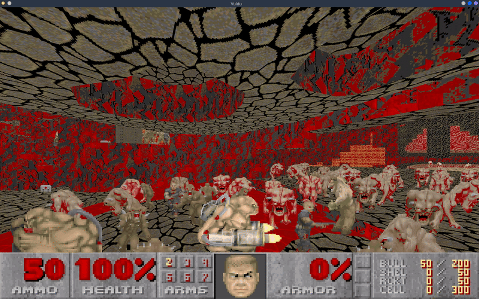

# Vuldu
**Vul[kan] du[um]** is a Doom port written by me
completely from scratch in Rust, with Vulkan 
rendering and the ECS pattern in the game loop. The 
project's ultimate goal is to achieve maximum 
performance on large maps through multithreaded 
computations, which was fundamentally impossible in the 
original *Id Tech 1*.

## How to Run
*Note: Vuldu requires a GPU with Vulkan 1.3 support.*

First, download the latest
[release](https://github.com/2017Knight2017/Vuldu/releases),
as well as the wad you want to run (for example,
DOOM2.WAD). To run it, open the command line in the
game folder and enter:

```bash
./vuldu -i your/path/to/DOOM2.WAD 
```

You can view the application's parameters
using `./vuldu -h`

## Technology Stack
- *[winit](https://github.com/rust-windowing/winit)* 
=> Window management
- *[hecs](https://github.com/Ralith/hecs)* 
=> Implementation of the ECS world and entities
- *[rodio](https://github.com/rustaudio/rodio)* 
=> Spatial audio
- *[serde](https://github.com/serde-rs/serde)* 
=> Parsing of toml tables
- *[cxx](https://github.com/dtolnay/cxx)* 
=> FFI bridge between Rust and the C++ renderer
- *[earcut](https://github.com/georust/earcut)* algorithm 
=> Floor triangulation
---
- *[rayon](https://github.com/rayon-rs/rayon)* 
and 
*[micropool](https://github.com/DouglasDwyer/micropool)* 
=> Parallelization of computations

It is important to note that I deliberately chose 
two libraries for multithreading, as they work 
differently and solve opposite problems:

*Rayon* is optimized for maximum performance.
It achieves this through **work stealing**: if
a thread finishes its work, it takes parts of the 
work from another thread. It works perfectly
for preparing data during loading.

However, practice shows that "work stealing"
is unstable when the game's framerate depends on it.
Therefore, I chose *micropool*, which works on the
principle of **busy waiting**: after finishing
their work, threads do not go to sleep, but wait so 
that they can start executing the next task as quickly
as possible. It works perfectly when more data needs 
to be processed without significantly increasing 
the load.

## Benchmarks & Performance Profile
Vuldu is engineered with data locality in mind to keep frame 
allocations close to zero during gameplay.

To push the engine to its limits, I benchmarked it on the 
iconic **Okuplok Slaughter Map** (oku2v31.wad), running around 
**23,000 active AI monsters** and complex geometry at once.

### Test Environment
- Map: DOOM2.WAD + oku2v31.wad
- Entities: ~23,000 active AI monsters
- Profiling Tool: Linux *perf* (Hardware Performance Counters)

### CPU & Cache Metrics (`perf stat`)
Here are the metrics by the Linux *perf*. Combining *hecs* for 
contiguous component memory with the chosen threading strategy 
(*micropool* for frame tasks, *rayon* for loading) helps keep 
CPU cache misses low:

| Metric | Measured Value | Notes |
| :--- | :--- | :--- |
| L1 Data Cache Miss Rate | **3.75%** *(1.83B misses / 48.8B loads)* | High cache locality |
| IPC (Instructions / Cycle) | **1.35** *(101.7B inst / 75.4B cycles)* | Low ALU stalls |
| Branch Miss Rate | **2.20%** *(304M misses / 13.8B branches)* | Predictable execution |
| Execution Bound Time | **42.9s** *(34.7s user / 1.48s sys)* | Stable CPU-bound workload |

> A **3.75% L1 miss rate** across 23,000 entities shows that 
the Data-Oriented ECS design successfully fits the active AI 
state into CPU caches, avoiding memory bandwidth bottlenecks.

## Project Architecture
The project is designed so that the crates are loosely coupled 
with each other in a *strictly one-way order*:

<details>
<summary><b>↓ Renderer ↓</b></summary>

The FFI bridge leads to `renderer_cpp/`, where the Vulkan
class is implemented in C++ and safely abstracted in
`src/lib.rs` for subsequent use of its methods in
Rust. The graphics pipeline is designed with
**mass resource processing** and minimization of
draw calls in mind.

Objects and UI make extensive use of **Instancing**,
allowing tens of thousands of instances to be displayed
on screen with almost no impact on FPS.
</details>

<details>
<summary><b> > App < </b></summary>

The main coordination center of the project. In
`App::resumed()` you can find the window initialization 
code, while `WindowEvent::RedrawRequested` contains the 
code for redrawing it.

Overall, in *App*, all other crates are merged together
in the form of `GraphicsContext` and `GameContext`, while 
also handling audio and user input.
</details>

<details>
<summary><b> ↑ Engine ↑ </b></summary>

This is where all ECS systems related to movement,
vision, sound propagation, etc. live. *Engine* can
modify level and entity data during gameplay.

There is more code inspired by John Carmack's 
[original source code](https://github.com/id-Software/DOOM/tree/master/linuxdoom-1.10) 
here than anywhere else in the project.
</details>

<details>
<summary><b> ↑ Wad Parser ↑ </b></summary>

In this crate, bytes from the wad are converted into 
textures and levels. All file resource management is 
handled through the `WadManager` object, which stores 
lumps associated with their source file.

In `src/textures/`, textures from the patch format
are converted into an array of PLAYPAL color indices. 
In `src/vertices/`, sectors and the linedefs surrounding 
them are triangulated into floors and walls and turned 
into a fully-fledged 3D scene.
</details>

## Building
For a local build, you need the
[Vulkan SDK]([https://vulkan.lunarg.com/sdk/home](https://vulkan.lunarg.com/sdk/home)). 
After installing it, clone the repository to your 
computer:

```bash
cd your/local/path
git clone https://github.com/2017Knight2017/Vuldu.git
```

Place the wad you plan to run (for example, DOOM2.WAD) 
there as well. After that, compile and run the project 
using cargo:

```bash
cargo build
cargo run -- -i DOOM2.WAD
```

## License
Vuldu is licensed under 
**GNU General Public License 3.0**.
